# 내 컴퓨터에 개발자용 '작업실' 꾸미기

# 프로젝트 개요:
  다음 조건을 만족하는 개발 워크스테이션 구축 결과물입니다.

 1) 제출 저장소(GitHub Repository): 공개된 저장소 링크만으로 아래 산출물 전부를 확인해야 함 등
 2) 기술 문서(README.md등): 기술 문서만 읽어도 전체 수행 내용을 파악할 수 있어야 함(별도 세부설명).
 3) 터미널 조작 로그: 터미널에서 수행한 핵심 명령과 출력 결과를 기술 문서에 기록해야 함.
 4) Docker 운영/검증 로그: 설치·점검 결과 및 운영 명령 실행 흔적이 있어야 함.
 5) Dockerfile 기반 웹 서버 컨테이너: 빌드/실행 명령 및 포트 매핑 접속 성공 내역이 있어야 함.
 6) 포트 매핑 접속 증거: 브라우저 접속 화면(주소창 포함)을 기술 문서에 첨부해야 함.
 7) 바인드 마운트 및 볼륨: 실행 명령이 있고, 호스트 변경 전/후 및 컨테이너 삭제 전/후를 비교해야 함.
 8) Git 설정 등: 연동 증거 등이 있고, 민감한 개인 정보(ID/PW, 토큰 등)가 포함되지 않아야 함.

 # 미션 목표 요약:
 이 과제를 마친 후, 학습자는 이를 스스로 설명할 수 있어야 함: 절대 경로와 상대 경로의 차이, 파일 권한의 의미와 그 표기의 해석 규칙, Dockerfile 기반 커스텀 이미지 제작, 포트 매핑이 필요한 이유,Docker 볼륨(영속 데이터), Git과 GitHub의 역할 차이.

# 실행 환경

항목	상세 내용
OS	macOS
Shell/Terminal	Bash/Zsh
Docker Version	24.0.x 이상
Git Version	2.40.x 이상

# 수행 항목 체크리스트
 - [ ]제출 저장소 및 기술문서
 - [ ]터미널 조작 로그 기록
 - [ ]권한 실습 및 증거 기록
 - [ ]Docker 설치 및 기본 점검
 - [ ]Docker 기본 운영 명령 수행
 - [ ]컨테이너 실행 실습
 - [ ]기존 Dockerfile 기반 커스텀 이미지 제작
 - [ ]포트 매핑 및 접속 증거
 - [ ]Docker 볼륨 영속성 검증
 - [ ]Git 설정 및 GitHub 연동
 - [ ]보안 및 개인정보 보호

 - [ ]보너스과제1. Docker Compose 기초
 - [ ]보너스과제2. Docker Compose 멀티 컨테이너
 - [ ]보너스과제3.Compose 운영 명령어 습득
 - [ ]보너스과제4.환경 변수 활용
 - [ ]보너스과제5.GitHub SSH 키 설정

# 결과 및 검증 방법
 
첫째, 최종 결과물의 조건, 기능 요구 사항, 제약 사항을 종합적으로 정리한 목록에 기반하여 새로이 실행 결과 및 검증 내역을 정리하였다.

둘째, 먼저, 제약 사항 중 공통적으로 해당하는 제약 사항은 아래와 같다.

-[x] 모든 작업은 터미널(CLI) 기반으로 수행한다.
-[x] 캡처/로그에는 “명령어 입력”과 “출력 결과”가 함께 포함되어야 한다.
-[x] 민감정보는 로그/이미지에 남기지 않는다(마스킹 필수).
-[x] 특정 개인 PC에 종속된 경로/설정이 있다면, 대체 방법 또는 주의사항을 함께 기록한다.

셋째, 기능 요구 사항의 순서에 따라 결과 및 검증 방법을 제시하면:

1) 제출 저장소 및 기술문서
-[x] 제출은 GitHub Repository 링크로 진행한다.
-[x] 공개(또는 과제 제출 규칙에 맞는 권한)로 생성한다.
-[x] 저장소 링크만으로 아래 산출물 전부를 확인할 수 있어야 한다.
-[x] GitHub Repository 링크로 제출한다.

2) 기술 문서

-[x]기술 문서(README.md 등)에 수행 로그와 증거가 모두 포함되어야 한다.(별도 파일로 분리하는 것은 가능하나, README에서 링크로 접근이 가능해야 한다.)
-[x]README만 보고도 평가자가 동일 절차를 따라 결과물을 확인할 수 있어야 한다.

기술 문서(README.md 등)는 아래 내용을 반드시 포함한다.
모든 수행 결과는 “기술 문서(README.md 등)”에서 확인 가능해야 한다.
  프로젝트 개요(미션 목표 요약)
  실행 환경(OS/쉘/터미널, Docker 버전, Git 버전)
  수행 항목 체크리스트(터미널/권한/Docker/Dockerfile/포트/볼륨/Git/GitHub)
  검증 방법(어떤 명령으로 무엇을 확인했는지) + 결과 위치 링크
  트러블슈팅 2건 이상(문제 → 원인 가설 → 확인 → 해결/대안)
  기술 문서만 읽어도 전체 수행 내용을 파악할 수 있어야 한다.
  기술 문서 내 명령/출력은 코드블록으로 정리한다.

3) 터미널 조작 로그 기록

(i)  터미널에서 수행한 핵심 명령과 출력 결과를 기술 문서에 기록한다.

(ii) 다음 작업을 터미널로 수행하고, 명령어 + 출력 결과를 기술 문서에 기록한다.: 현재 위치 확인, 목록 확인(숨김 파일 포함), 이동, 생성, 복사, 이동/이름변경, 삭제, 파일 내용 확인, 빈 파일 생성.

(iii) 터미널 조작 로그 (Terminal Operation Log) 명령어 및 결과

```bash
pwd #현재 위치 확인

ls -al # 목록 확인, # 숨김 파일 포함(-a)

mkdir workspace # 폴더 생성
cd workspace # 이동

touch empty.txt # 빈 파일 생성
echo 'Hello, Docker and Git!' > memo.txt

cat memo.txt #파일 내용 확인
Hello, Docker and Git!


cp memo.txt memo_backup.txt # 파일 복사 후 확인
ls
empty.txt  memo.txt  memo_backup.txt

mv memo_backup.txt renamed_memo.txt # 이름 변경 (이동)
ls
empty.txt  memo.txt  renamed_memo.txt

rm empty.txt # 파일 삭제
ls
memo.txt  renamed_memo.txt

cd .. # 폴더 삭제 (상위 폴더로 이동 후 삭제)
rm -rf workspace/
ls  # workspace 폴더가 삭제됨
```
-- 트러블슈팅1: mv 명령어의 실행
문제:
 mv: rename renamed_memo.txt to backup/renamed_memo.txt: No such file or directory
원인 가설: 그때의 내 폴더는 나의 현재위치(pwd)에 소속한 폴더여야 한다.
확인: mv 명령어는 "이미 존재하는 목적지"로 옮기거나, 아니면 "새로운 이름"으로 바꾸는 역할을 한다.
해결/대안: 목적지가 폴더일 때, 그 폴더가 미리 만들어져 있어야 파일이 그 안으로 들어간다. 목적지가 폴더가 아닐 때 터미널은 그냥 파일 이름을 바꾼다. 이에 따라 나의 위치에 폴더를 만들고 수행하여 해결했다.

결과는 아래와 같다.
<스크린샷>
 

(v) 권한을 확인/변경하는 명령을 수행하고, 변경 전/후 비교를 기술 문서에 남긴다.
최소 요구: 파일 1개, 디렉토리 1개에 대해 권한 변경 실험을 수행한다.

```bash
ls -l memo.txt  # 파일 권한 변경 전 확인: r (Read), w (Write), x (Execute)
chmod 400 memo.txt #  권한 변경; Read-only 설정
ls -l memo.txt  # 변경 후 확인 결과: 맨 아래 'permission denied: memo.txt'

ls -ld backup    #. 디렉토리 권한 변경 전 확인(폴더 자체를 볼 때는 -d 옵션 필요)
chmod 777 backup   # 권한 변경; Full Access 설정
ls -ld backup     # 변경 후 확인 (모든 권한 개방 확인) 권한의 원리(숫자 4, 2, 1의 합).
```

결과는 아래와 같다.
<스크린샷>
 

4) Docker 운영/검증 로그
-[x]Dockerfile은 직접 작성해야 한다.

(1) Docker 설치 및 기본 점검
  docker --version, docker info 등 설치·점검 결과
  Docker 버전 확인 결과를 기록한다. (docker --version)
Docker 데몬 동작 여부 확인 결과를 기록한다. (docker info 또는 동등 점검)

(2) Docker 기본 운영 명령 수행

  docker images, docker ps -a, docker logs, docker stats 등 운영 명령 실행 흔적
이미지: 다운로드/목록 확인 (예: docker images)
컨테이너: 실행/중지/목록 확인 (예: docker ps, docker ps -a)
운영: 로그 확인 (예: docker logs), 리소스 확인 (예: docker stats)
수행 명령과 출력 결과를 기술 문서에 남긴다.

```bash
docker --version  #Docker 버전 확인
docker info #버전 확인 결과

```
결과는 아래와 같다. Operating System: OrbStack 도 확인 가능하다.
<스크린샷>
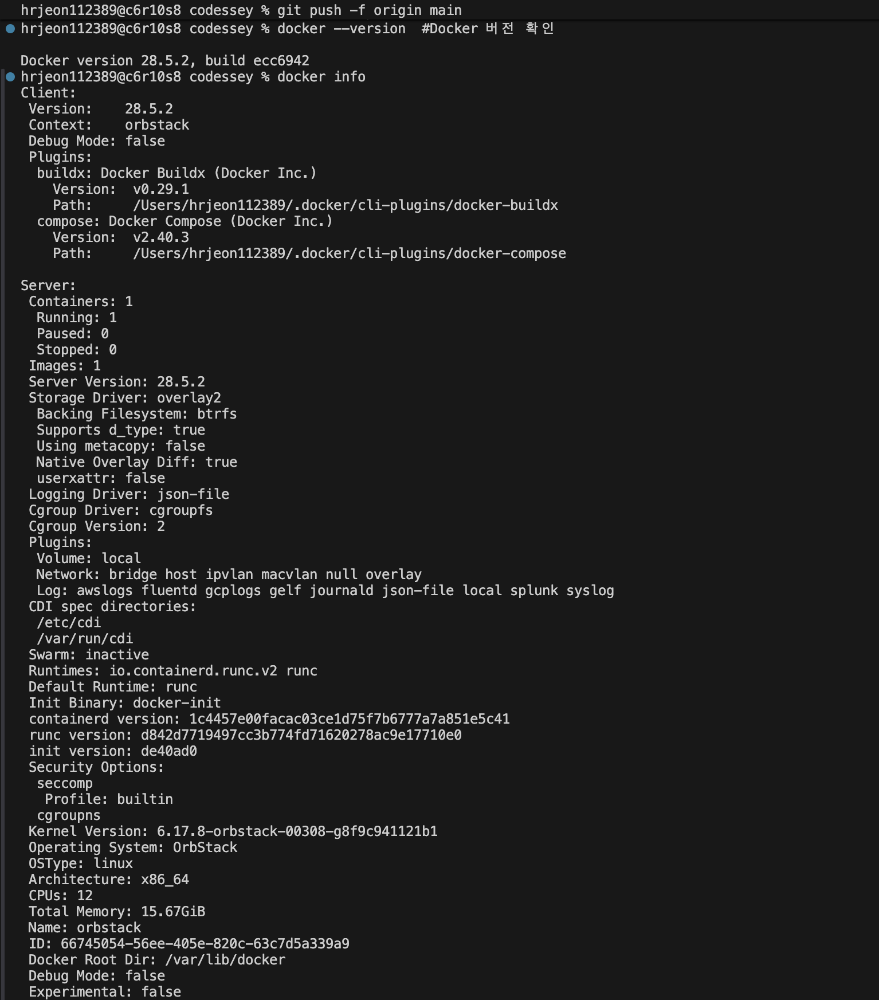 
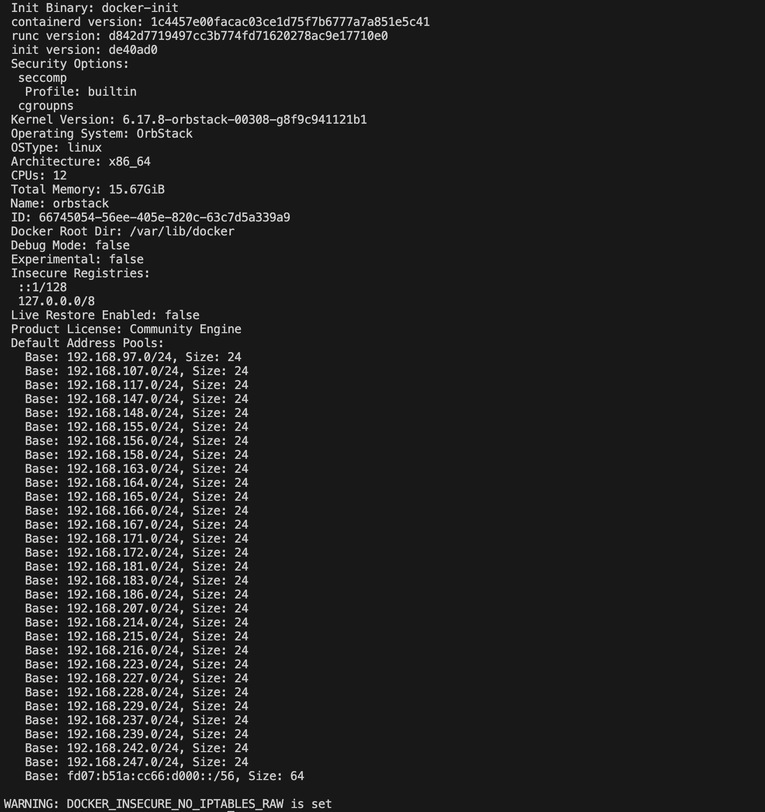 


(3) 컨테이너 실행 실습
docker에서 hello-world 실행 성공을 기록한다.
ubuntu 컨테이너를 실행하고 내부 진입 후 간단 명령(예: ls, echo) 수행 결과를 기록한다.
컨테이너 종료/유지(attach/exec 등)의 차이를 스스로 관찰하고 간단히 정리한다.

```bash
$ docker run hello-world
# Docker Hello-World 

Unable to find image 'hello-world:latest' locally
latest: Pulling from library/hello-world
4f55086f7dd0: Pull complete 
Digest: sha256:c3cbe1cc1aa588a64951ac6286e0df7b27fe2e6324b1001c619bb358770c0178
Status: Downloaded newer image for hello-world:latest

Hello from Docker!
This message shows that your installation appears to be working correctly.

To generate this message, Docker took the following steps:
 1. The Docker client contacted the Docker daemon.
 2. The Docker daemon pulled the "hello-world" image from the Docker Hub.
    (amd64)
 3. The Docker daemon created a new container from that image which runs the
    executable that produces the output you are currently reading.
 4. The Docker daemon streamed that output to the Docker client, which sent it
    to your terminal.

To try something more ambitious, you can run an Ubuntu container with:
 $ docker run -it ubuntu bash

Share images, automate workflows, and more with a free Docker ID:
 https://hub.docker.com/

For more examples and ideas, visit:
 https://docs.docker.com/get-started/

# 1. ubuntu 이미지 다운로드 및 컨테이너 실행 (it 옵션은 터미널 상호작용을 위해 필수!)
$ docker run -it ubuntu bash

Unable to find image 'ubuntu:latest' locally
latest: Pulling from library/ubuntu
ed819469700f: Pull complete 
a3679419df18: Pull complete 
Digest: sha256:3131b4cc82a783df6c9df078f86e01819a13594b865c2cad47bd1bca2b7063bb
Status: Downloaded newer image for ubuntu:latest
root@e993cf72e85d:/# 

# 2. 컨테이너 내부(root@...)에서 아래 명령어 입력.
$ ls -al

root@*********d:/# ls -al
total 16
drwxr-xr-x   1 root root   6 Jul 30 09:23 .
drwxr-xr-x   1 root root   6 Jul 30 09:23 ..
-rwxr-xr-x   1 root root   0 Jul 30 09:23 .dockerenv
drwxr-xr-x   1 root root  26 Jul 13 16:06 .rock
lrwxrwxrwx   1 root root   7 Apr 20 08:46 bin -> usr/bin
drwxr-xr-x   1 root root   0 Apr 20 08:46 boot
drwxr-xr-x   5 root root 340 Jul 30 09:23 dev
drwxr-xr-x   1 root root  56 Jul 30 09:23 etc
drwxr-xr-x   1 root root  12 Jul 13 16:06 home
lrwxrwxrwx   1 root root   7 Apr 20 08:46 lib -> usr/lib
lrwxrwxrwx   1 root root   9 Apr 20 08:46 lib64 -> usr/lib64
drwxr-xr-x   1 root root   0 Jul 13 16:05 media
drwxr-xr-x   1 root root   0 Jul 13 16:05 mnt
drwxr-xr-x   1 root root   0 Jul 13 16:05 opt
dr-xr-xr-x 305 root root   0 Jul 30 09:23 proc
drwx------   1 root root  30 Jul 13 16:06 root
drwxr-xr-x   1 root root  22 Jul 13 16:06 run
lrwxrwxrwx   1 root root   8 Apr 20 08:46 sbin -> usr/sbin
drwxr-xr-x   1 root root   0 Jul 13 16:05 srv
dr-xr-xr-x  11 root root   0 Jul 30 09:23 sys
drwxrwxrwt   1 root root   0 Jul 13 16:06 tmp
drwxr-xr-x   1 root root  10 Jul 13 16:05 usr
drwxr-xr-x   1 root root  90 Jul 13 16:06 var

$ root@*********d: /# echo "Hello from Docker Ubuntu" # ls, echo 실행 시 화면 차이
Hello from Docker Ubuntu

$ root@*********d: /# cat /etc/os-release
PRETTY_NAME="Ubuntu 26.04 LTS"
NAME="Ubuntu"
VERSION_ID="26.04"
VERSION="26.04 LTS (Resolute Raccoon)"
VERSION_CODENAME=resolute
ID=ubuntu
ID_LIKE=debian
HOME_URL="https://www.ubuntu.com/"
SUPPORT_URL="https://help.ubuntu.com/"
BUG_REPORT_URL="https://bugs.launchpad.net/ubuntu/"
PRIVACY_POLICY_URL="https://www.ubuntu.com/legal/terms-and-policies/privacy-policy"
UBUNTU_CODENAME=resolute
LOGO=ubuntu-logo

# 3. 컨테이너에서 나오기
$ exit
$ root@*********d:/# exit
exit
hrjeon112389@c6r10s8 Codessey % 

# 컨테이너 종료 vs 유지 (개념 정리)
# 백그라운드에서 실행 (-d 옵션)
$ docker run -d --name my-ubuntu ubuntu sleep infinity
f04d39ce28ad8aa825ef6d8661ecc4070e0cfb23985cc1c3300c774666fc8100
hrjeon112389@c6r10s8 Codessey % 
# 실행 중인 컨테이너에 들어가기
docker exec -it my-ubuntu bash
root@*********d:
# 여기서 exit으로 나와도 컨테이너는 계속 실행 중입니다!

$ docker ps
CONTAINER ID   IMAGE          COMMAND                  CREATED              STATUS              PORTS                                     NAMES
f04d39ce28ad   ubuntu         "sleep infinity"         About a minute ago   Up About a minute                                             my-ubuntu
8b31c2fdbb15   mac-quiz-app   "/docker-entrypoint.…"   11 hours ago         Up 11 hours         0.0.0.0:8080->80/tcp, [::]:8080->80/tcp   dev-energy-quiz-container

```
run: 새로운 컨테이너를 만들고 실행함.
-it로 들어가서 exit하면 컨테이너도 같이 멈춤.
exec: 이미 실행 중인 컨테이너에 새로운 명령을 내리거나 접속함.
exit으로 나와도 컨테이너는 죽지 않고 계속 돌아감.
attach: 실행 중인 컨테이너의 메인 프로세스(표준 입출력)에 연결함. (잘못 종료하면 컨테이너가 멈출 수 있음)

결과는 아래와 같다.
<스크린샷>
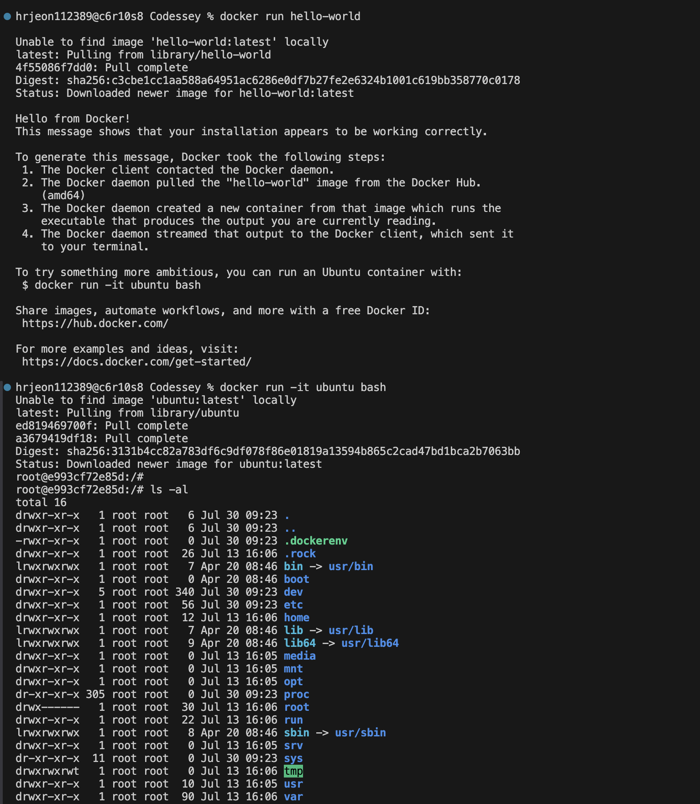 
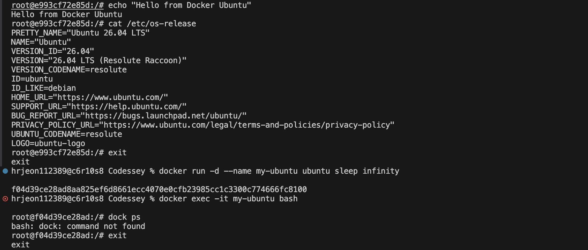 


5) Dockerfile 기반 웹 서버 컨테이너 제작

아래 방식 중 하나를 선택하여 기존 Dockerfile/이미지 기반의 커스텀 이미지를 만든다.
(A) 웹 서버 베이스 이미지 활용(예: NGINX/Apache 등) + 정적 콘텐츠/설정만 교체
(B) Linux 베이스 이미지(예: ubuntu/alpine 등) + 기본 기능(패키지/사용자/환경변수/헬스체크 등) 추가

제작 결과는 아래 조건을 만족해야 한다.
- 커스텀 이미지 빌드 성공 및 컨테이너 실행 성공

기술 문서에 다음을 포함한다.
- 어떤 “기존 베이스(이미지/예시 Dockerfile)”를 선택했는지
- 내가 적용한 커스텀 포인트 각각의 목적(간단 요약)
- 빌드/실행 명령 + 핵심 결과(출력/스크린샷)

<결과>

선택한 베이스 이미지: nginx:latest (가볍고 강력한 웹 서버 엔진)
커스텀 포인트:
정적 콘텐츠 교체: 기본 NGINX 페이지 대신 직접 작성한 index.html을 COPY 명령어로 삽입.
환경 변수 설정: ENV 명령어를 통해 서버 이름을 지정하는 연습 수행.

```bash
mkdir my-web-server
cd my-web-server
# index.html 파일 생성
echo "<h1>Hello, Docker! This is My Custom Web Server.</h1>" > index.html
# Dockerfile 작성
touch Dockerfile

cat <<EOF > Dockerfile
FROM nginx:latest
COPY index.html /usr/share/nginx/html/index.html
EXPOSE 80
EOF

# 1. 이미지 빌드 (이름은 my-nginx, 버전은 1.0)
docker build -t my-nginx:1.0 .

# 2. 빌드된 이미지 확인
docker images

# 3. 컨테이너 실행 (내 컴퓨터의 8080 포트와 컨테이너의 80 포트 연결)
docker run -d -p 8080:80 --name my-web-container my-nginx:1.0

# 4. 결과 확인
curl localhost:8080
```
-- 트러블슈팅2: 
문제: port is already allocated
원인 가설: 현재 사용 중인 컴퓨터(Host)의 8080 포트를 이미 다른 프로그램이나 이전에 실행한 컨테이너가 사용하고 있어서 충돌이 발생한 상황
확인: 8080 대신 8081이나 9000 같은 다른 포트를 사용해 보세요. 맞음.
해결/대안: 만약 이전에 실행했던 컨테이너가 8080을 잡고 있다면, 그 컨테이너를 중지하고 삭제해야 합니다.

```bash
$ docker ps

CONTAINER ID   IMAGE          COMMAND                  CREATED          STATUS          PORTS                                     NAMES
f04d39ce28ad   ubuntu         "sleep infinity"         13 minutes ago   Up 13 minutes                                             my-ubuntu
8b31c2fdbb15   mac-quiz-app   "/docker-entrypoint.…"   11 hours ago     Up 11 hours     0.0.0.0:8080->80/tcp, [::]:8080->80/tcp   dev-energy-quiz-container

# 1. 기존 퀴즈 앱 컨테이너 중지 및 삭제
$ docker stop dev-energy-quiz-container
$ docker rm dev-energy-quiz-container
dev-energy-quiz-container
dev-energy-quiz-container
# 2. 아까 실패했던 내 웹 서버 다시 실행
$ docker run -d -p 8080:80 --name my-web-container my-nginx:1.0
b32f3f240baa79cfaa6b9cee4eb19823b0d00e95cfd6921881256654fdfaa2a0
```

결과는 아래와 같다.
<스크린샷>
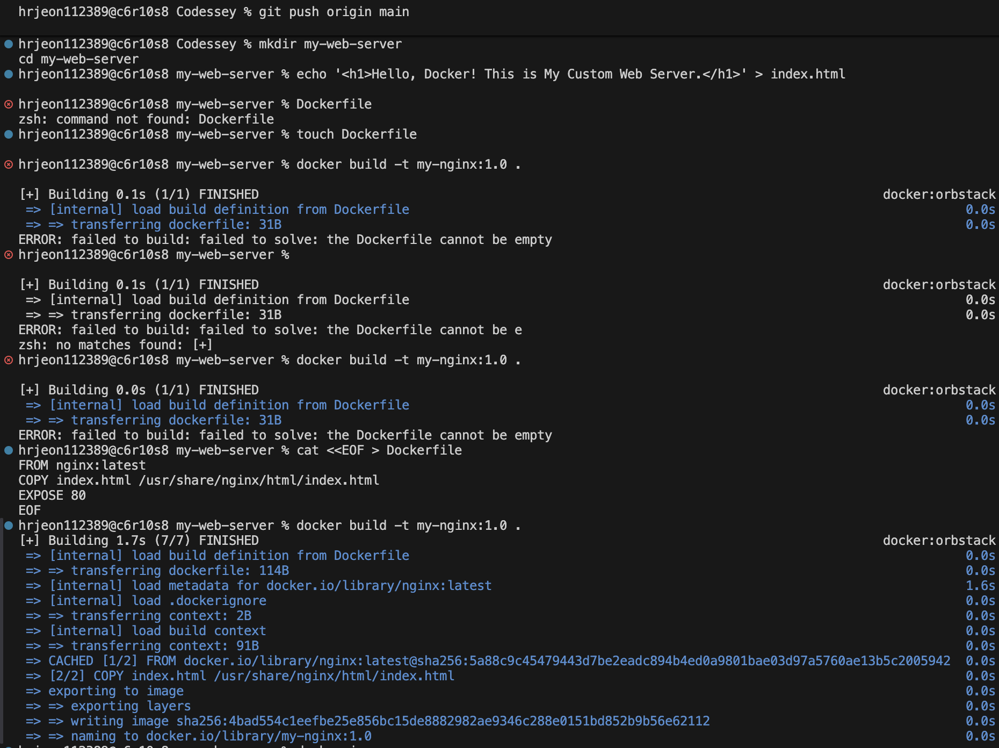 
(트러블슈팅 결과)
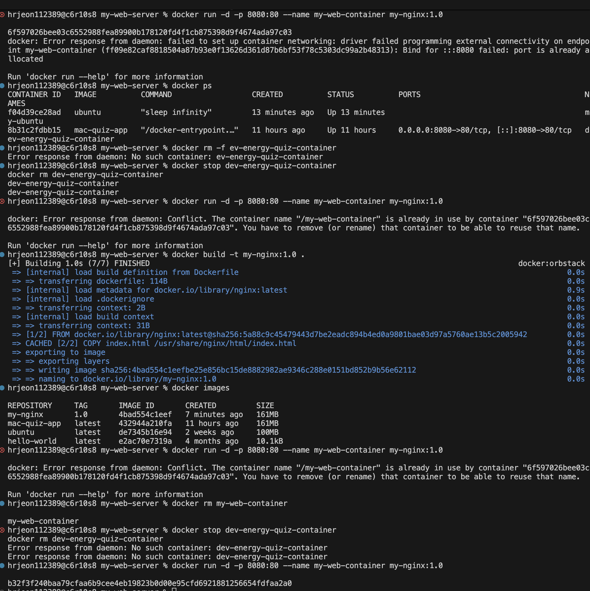 


6) 포트 매핑 접속 증거
-[x]포트 매핑과 마운트/볼륨은 직접 설정하고 동작을 검증해야 한다.
-[x]브라우저 접속 증거는 주소창(포트 포함)과 응답 화면이 함께 보이도록 한다.

브라우저 접속 화면(또는 curl 응답)을 기술 문서에 첨부한다.
웹 서버 환경의 구축
 - 웹 서버 소스코드(예: app/ 또는 src/)
 - Dockerfile
 - 빌드/실행 명령 및 결과 로그(터미널 스크린샷 가능)
 - 포트 매핑 접속 성공 증거(스크린샷 또는 로그)

결과는 아래와 같다.
<스크린샷>
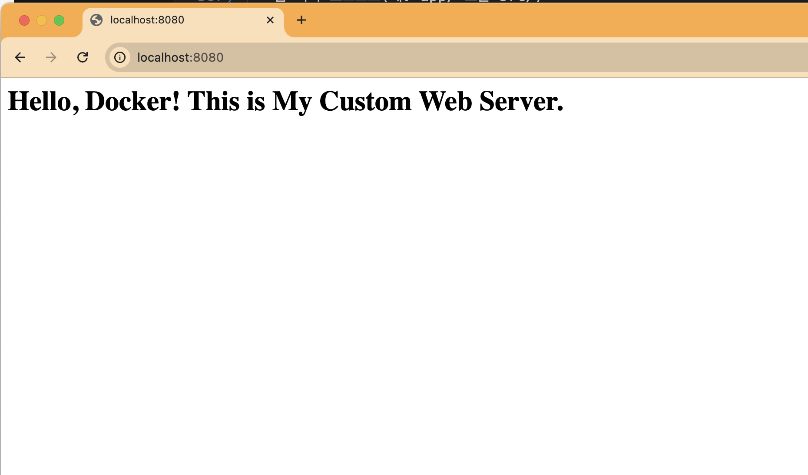 

7) 바인드 마운트 반영 + 볼륨 영속성 증거
  바인드 마운트: 실행 명령 + 호스트 변경 전/후 비교
  Docker 볼륨: 생성/연결/검증 명령 + 컨테이너 삭제 전/후 비교
 - Docker 볼륨을 생성하고 컨테이너에 연결한다.
 - 컨테이너 삭제 전/후로 데이터를 확인하여 데이터가 유지됨을 증명한다.
 - 기술 문서에 생성/연결/검증 절차(명령+출력)를 포함한다

```bash
#바인드 마운트(Bind Mount) 목적: 호스트와 컨테이너의 파일 시스템(내 특정폴더) 실시간 동기화
$ mkdir html
$ echo "<h1>Before Change</h1>" > html/index.html

$ docker run -d -p 8081:80 -v $(pwd)/html:/usr/share/nginx/html --name bind-mount-test nginx

# [전] 브라우저 캡쳐(Before Change).
# [중] 문구 변경
$ echo '<h1>After Change - Bind Mount Success!</h1>' > html/index.html
# [후] 브라우저 캡쳐(After Change - Bind Mount Success).
```

결과는 아래와 같다.
<스크린샷>
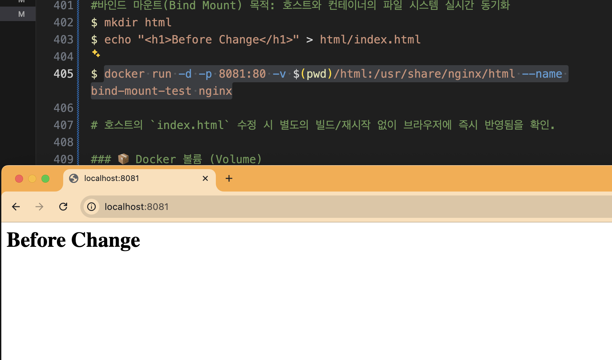 
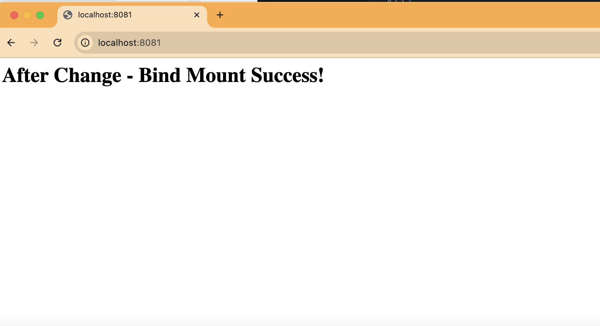 


Docker 볼륨(Volume): 컨테이너 삭제 후에도 데이터 유지(영속성 증명, 주로 DB 데이터 저장)

```bash
# 볼륨 생성 및 확인
$ docker volume create my-db-volume
$ docker volume ls

DRIVER    VOLUME NAME
local     my-db-volume

# 첫 번째 컨테이너 실행 및 데이터 쓰기
docker run -it --name vol-test-1 -v my-db-volume:/app ubuntu bash
# 컨테이너 내부 접속 후
echo "Persistence Data" > /app/data.txt
exit
# 컨테이너 삭제 (데이터가 사라질까요?)
docker rm vol-test-1
# 두 번째 컨테이너 실행 및 데이터 확인
docker run -it --name vol-test-2 -v my-db-volume:/app ubuntu bash
# 컨테이너 내부 접속 후
cat /app/data.txt
# "Persistence Data"가 출력되면 성공!
exit
```
결과는 아래와 같다.
<스크린샷>
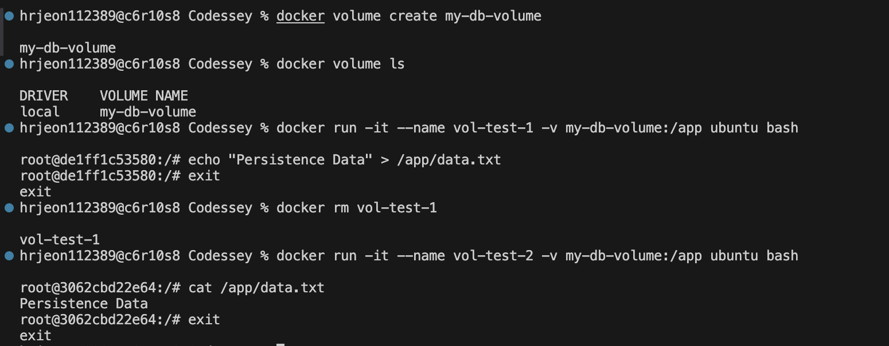 

 보너스과제(1) Docker Compose 기초
  docker-compose.yml의 기본 구조를 학습하고, 단일 서비스를 Compose로 실행한다.
배움 포인트: 컨테이너 실행 명령이 “문서화된 실행 설정”으로 바뀌는 이유

 - 문서화: 명령어가 파일로 저장되니, 나중에 봐도 "아, 이 컨테이너는 8081 포트를 썼구나!"라고 바로 알 수 있습니다.
 - 협업: 이 파일만 팀원에게 주면, 팀원도 나와 똑같은 환경을 한 줄의 명령어로 실행할 수 있습니다.
 - 관리: 여러 개의 컨테이너(DB, 웹서버, 캐시 등)를 한 번에 켜고 끌 수 있습니다.

결과는 아래와 같다.

```bash
# 실행 중 컨테이너 정리
$ docker stop bind-mount-test
bind-mount-test
$ docker rm bind-mount-test
bind-mount-test

# 문서화 된 컨테이너 정의
cat <<EOF > docker-compose.yml
version: '3.8'
services:
  web:
    image: nginx
    ports:
      - "8081:80"
    volumes:
      - ./html:/usr/share/nginx/html
    restart: always
EOF
# 컨테이너 업로드
docker compose up -d
# 컨테이너 확인
docker compose ps

```
<스크린샷>
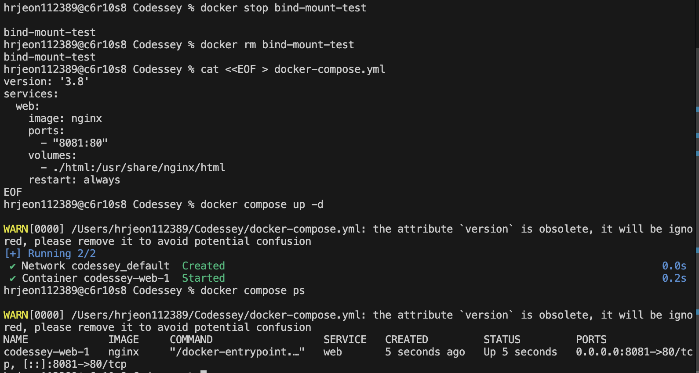 


 보너스과제(2) Docker Compose 멀티 컨테이너

  웹 서버 + (임의의 보조 서비스) 2개 이상을 Compose로 함께 실행한다.
  컨테이너 간 네트워크 통신이 가능한지 확인한다.
  배움 포인트: 네트워크/서비스 디스커버리 개념 맛보기

 - Docker의 진정한 강력함인 멀티 컨테이너 오케스트레이션
 - 서비스 디스커버리 (Service Discovery): Docker Compose로 실행된 컨테이너들은 자동으로 같은 네트워크에 소속됩니다. 이때 아주 놀라운 기능이 있는데, 서비스 이름이 곧 도메인 주소(IP)가 된다는 점입니다. web 컨테이너에서 api 컨테이너로 접속하고 싶다면? http://api라고 주소를 치면 됩니다.

즉,
- 멀티 컨테이너:	웹, DB, API 등 역할을 나누어 관리 (마이크로서비스 구조의 기초).
- Default Network	Compose는 실행 시 자동으로 전용 네트워크를 생성함
- Service Discovery	IP 주소 대신 api, db 같은 서비스 이름으로 서로를 찾음.

```bash
# 기존 파일을 수정하여 web(Nginx)과 api(Whoami - 접속 정보를 보여주는 가벼운 서비스) 두 개를 띄워보겠습니다.
cat <<EOF > docker-compose.yml
version: '3.8'

services:
  web:
    image: nginx
    ports:
      - "8081:80"
    volumes:
      - ./html:/usr/share/nginx/html

  api:
    image: traefik/whoami
    # 외부 노출 없이 내부 통신 확인용으로만 사용
EOF
# 컨테이너 실행
docker compose up -d
# 컨테이너 간 통신 검증 (핵심!)
# 1) web 컨테이너에 접속하여 curl 설치: Nginx 기본 이미지에는 curl이 없으므로 설치가 필요합니다.
docker compose exec web apt-get update
docker compose exec web apt-get install -y curl
# 2) 서비스 이름으로 통신 시도
docker compose exec web curl api
## 결과 확인:
### 터미널에 Hostname: ..., IP: ... 같은 정보가 출력된다면 성공입니다!
### web 컨테이너가 api라는 이름만으로 상대방의 IP를 찾아내어 통신에 성공한 것입니다.
```

결과는 아래와 같다.
<스크린샷>
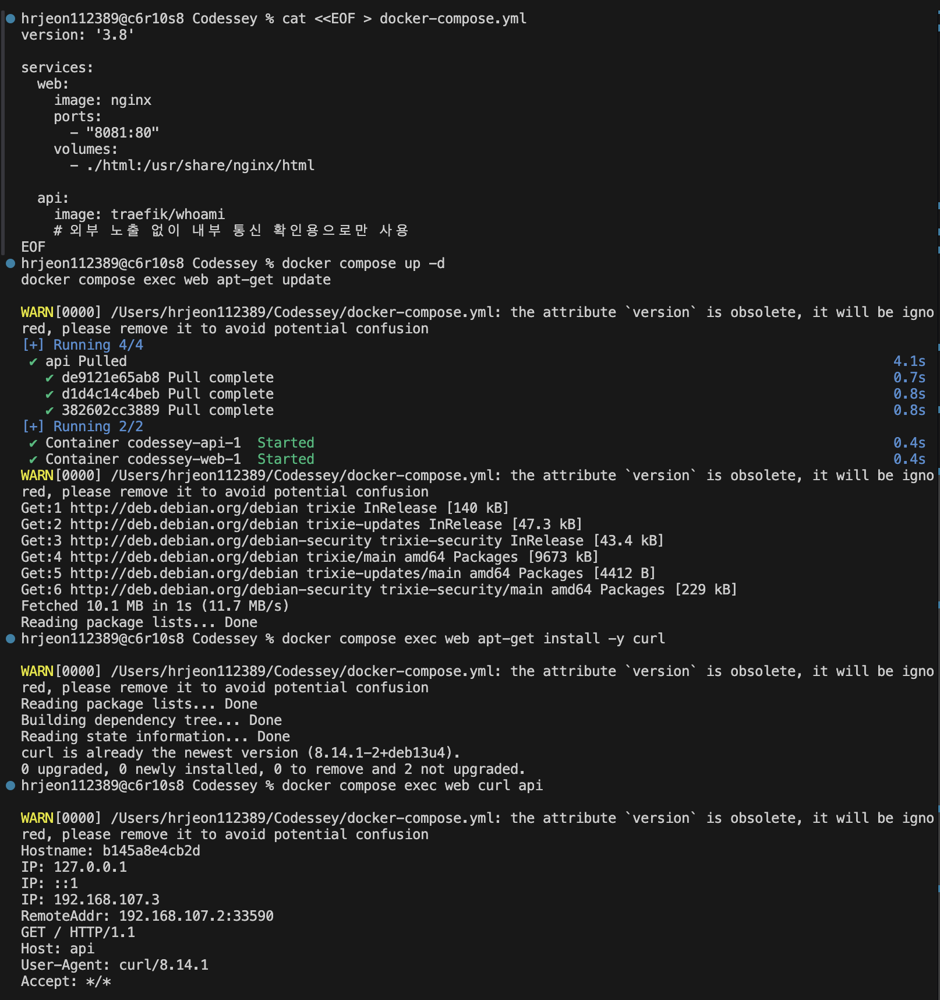 


보너스과제(3) Compose 운영 명령어 습득

  up, down, ps, logs를 사용해 실행/종료/상태/로그를 관리한다.
배움 포인트: 운영 관점의 “상태 확인 루틴” 만들기
- 컨테이너를 잘 띄우는 것만큼 중요한 것이 "지금 잘 돌아가고 있는지 확인하고, 문제가 생겼을 때 원인을 찾는 것"이다. 운영의 핵심: 상태 확인 루틴 (Status Check Routine)

- 실무자들은 컨테이너를 관리할 때 보통 아래 4단계 루틴을 반복한다.

```bash
# 1단계: 실행 (up) // -d: 백그라운드 실행. 터미널을 계속 쓸 수 있게 해줍니다.
docker compose up -d
# 2단계: 목록 및 상태 확인 (ps) // STATUS가 Up인지, PORTS가 의도대로(8081->80) 연결되었는지 확인.
docker compose ps
# 3단계: 실시간 로그 모니터링 (logs) "컨테이너 내부"를 확인. (디버깅의 핵심!)
docker compose logs -f --tail=20
# 4단계: 종료 및 정리 (down) stop은 멈추기만 하지만, down은 컨테이너와 생성된 네트워크까지 모두 삭제
docker compose down
```

- 가시성: 눈에 보이지 않는 컨테이너 내부 상황을 ps와 logs로 시각화할 수 있다.
- 자원 관리: down을 생활화하면 쓰지 않는 컨테이너가 메모리를 잡아먹는 일을 방지할 수 있다.
- 신속한 대응: 서비스가 안 될 때 가장 먼저 logs를 보는 습관이 개발 시간을 수십 배 단축해 준다.
- docker compose stop 실행 후 docker compose ps -a를 쳐보세요. -> 컨테이너가 Exited 상태로 남아있다.
docker compose down 실행 후 docker compose ps -a를 쳐보세요. -> 컨테이너가 목록에서 완전히 사라진다.

결과는 아래와 같다.
<스크린샷>
 


 보너스과제(4) 환경 변수 활용
  Dockerfile 또는 Compose에서 환경 변수를 주입해 서버 포트/모드를 바꿔본다.
배움 포인트: 설정과 코드의 분리
 - 환경 변수(Environment Variables) 활용 단계: "코드와 설정을 분리한다"는 원칙은 현대 개발(The Twelve-Factor App)에서 매우 중요하다. 똑같은 이미지라도 환경 변수만 바꾸면 '개발용'이 되기도 하고 '배포용'이 되기도 하다.

 ```bash
# 프로젝트 루트 폴더에 환경 변수를 저장할 파일: .env 파일
## .gitignore에 추가하는 것이 관례
### 보안상 중요한 정보(비밀번호, API 키 등)가 GitHub에 올라가지 않도록 설정합니다.
cat <<EOF > .env
WEB_PORT=8082
APP_ENV=development
EOF
# 1. .env 파일을 .gitignore에 추가하기 (터미널) 
### >>는 파일의 기존 내용 뒤에 새로운 내용을 덧붙이는 명령어
## 보안상 중요한 정보(비밀번호, API 키 등)가 GitHub에 올라가지 않도록 설정합니다.
echo ".env" >> .gitignore
# 설정이 잘 되었는지 확인합니다.
cat .gitignore
# 2. .env 파일 생성 및 변수 설정
cat <<EOF > .env
WEB_PORT=8082
APP_ENV=development
EOF
```
결과는 아래와 같습니다다.
<스크린샷>
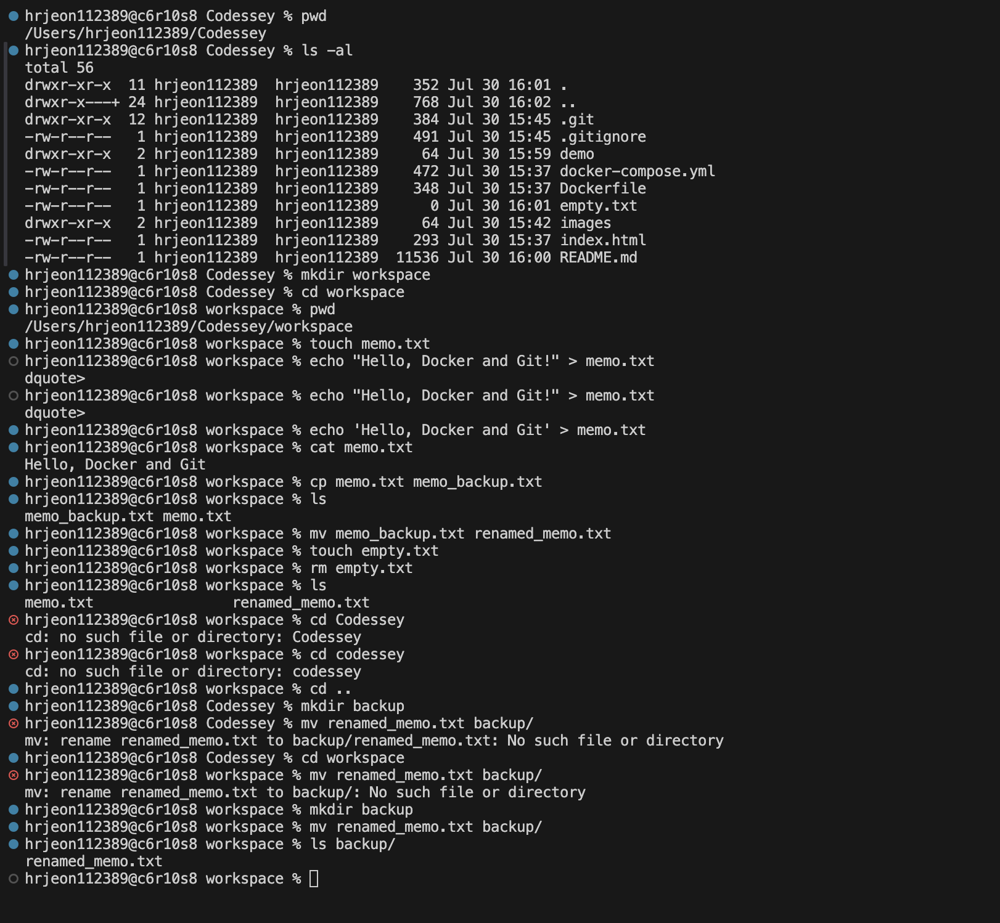 


이제 docker-compose.yml 파일을 열어 하드코딩된 숫자 대신 ${변수명} 형식을 사용하도록 수정합니다. 
```yaml
# docker-compose.yml 수정 (변수 문법 적용)
version: '3.8'

services:
  web:
    image: nginx
    ports:
      # ${WEB_PORT}는 .env 파일의 8082로 치환됩니다.
      - "${WEB_PORT}:80"
    environment:
      # 컨테이너 내부 환경변수로 APP_MODE를 전달합니다.
      - APP_MODE=${APP_ENV}
    volumes:
      - ./html:/usr/share/nginx/html

  api:
    image: traefik/whoami
```
결과 검증 (중요!)
 - 명령어를 실행하기 전에, Docker가 변수를 제대로 인식했는지 터미널에서 확인합니다.

``` bash
# ① 변수 치환 결과 확인
docker compose config
## 확인 포인트: 출력된 내용 중에 ports: - "8082:80"이라고 나오나요? 그렇다면 성공

# ② 컨테이너 실행 및 확인
docker compose up -d

# 실행 상태 확인 (8082 포트 확인)
docker compose ps

# ③ 컨테이너 내부 환경변수 확인: 실제로 APP_MODE가 주입되었는지 확인합니다.

docker compose exec web env | grep APP_MODE
## 결과: APP_MODE=development가 출력되어야 합니다.
```

결과는 아래와 같습니다다.
<스크린샷>
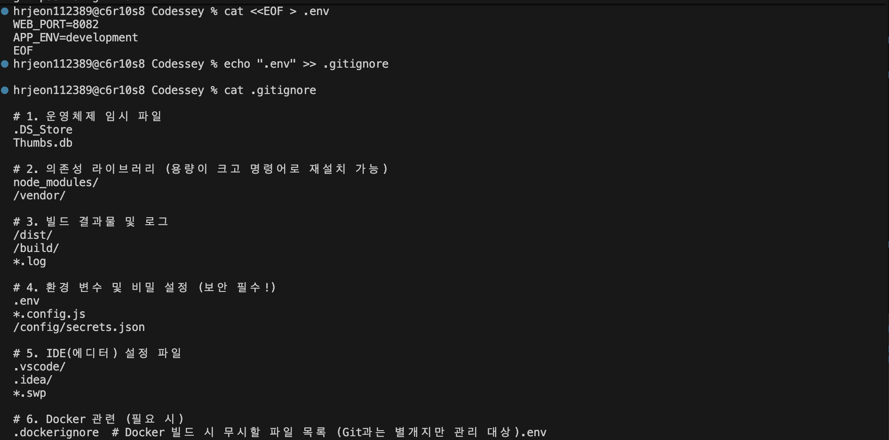 


  환경 변수(Environment Variables) 활용으로, .env 파일을 만들어 설정값을 관리하고, docker-compose.yml에서 이 변수들을 불러와 포트 번호와 실행 모드를 변경했습니다. 

- 변수 WEB_PORT 가	설정값 8082	호스트 포트 적용되어 docker compose ps에서 8082 확인했고,
- 변수 APP_ENV 가	설정값 development 를 컨테이너 내부 환경변수에서 적용하여	exec env 명령어로 확인되었습니다.

[핵심] 설정과 코드의 분리
  이와 같은 설정과 코드의 분리가 핵심입니다.
  기존 방식은	포트 번호를 바꾸려면 docker-compose.yml 코드를 직접 수정해야 했는데, 환경 변수 방식	코드는 그대로 두고 .env 파일의 숫자만 바꾸면 됩니다. 즉,
  1. 보안(비밀번호 등) 유지, 2. 개발/테스트/운영 환경 전환 용이
  하다는 장점이 있습니다.

요약하면, 
.gitignore: 보안을 위해 설정 파일(.env)은 Git에 올리지 않는다.
${VARIABLE}: docker-compose.yml에서 외부 변수를 가져오는 표준 문법이다.
docker compose config: 실행 전 설정 오류를 잡아내는 아주 유용한 습관이다.

  이제 환경 변수까지 마스터하셨으니, 어떤 환경에서도 유연하게 돌아가는 "설정 가능한(Configurable) 시스템"을 만드실 수 있게 되었습니다.

(참고: 실제 협업 시에는 .env는 커밋하지 않고 .env.example 파일을 만들어 공유하는 것이 매너입니다!)


8) Git 설정 및 GitHub/VSCode 연동 증거

 Git 사용자 정보·기본 브랜치 설정 후, VSCode에서 GitHub 로그인 및 저장소 연동 완료
  민감한 개인 정보(ID/PW, 토큰 등)가 포함되지 않도록 주의한다.
* Git 사용자 정보/기본 브랜치 설정을 완료하고 git config --list 결과를 기록한다.
* GitHub 로그인 및 저장소 연동을 완료하고, 연동 증거(스크린샷 등)를 기술 문서에 첨부한다.

```Bash
# Git 환경 설정
$ git config --global user.name "Your Name"
$ git config --global user.email "your.email@example.com"
$ git config --global init.defaultBranch main

# 설정 결과 검증
$ git config --list

# 저장소 초기화 및 커밋 로그

$ cd ~/my-nginx-server
$ git init
$ git add .
$ git commit -m "Docker NGINX 커스텀 서버 및 Compose 구축 완료"

# Commit Log 확인
$ git log --oneline
a1b2c3d (HEAD -> main) Docker Compose 설정 파일 추가
f4e5d6c Docker NGINX 커스텀 서버 구축 완료

```

<스크린샷>
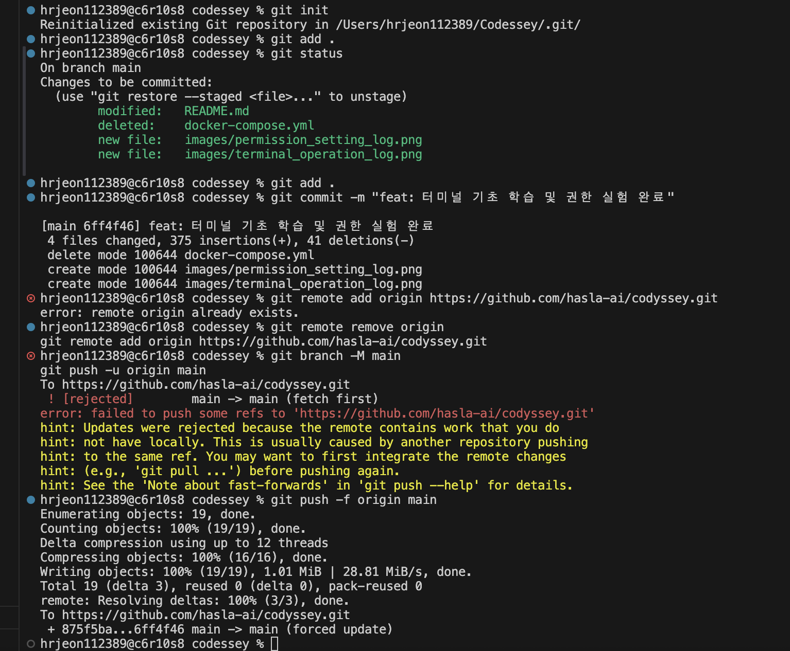 

결과는 아래와 같다.
<스크린샷>
 


9) 보안 및 개인정보 보호
* 기술 문서/로그/스크린샷에 토큰, 비밀번호, 개인키, 인증 코드 등이 포함되지 않도록 마스킹한다.
* 의심되는 민감정보가 노출된 경우, 즉시 히스토리/문서에서 제거하고 재발급 절차를 수행한다 (가능한 범위에서).

보너스과제(5) GitHub SSH 키 설정
HTTPS 대신 SSH로 푸시가 가능하도록 키를 등록하고 동작을 확인한다.
배움 포인트: 인증 방식 차이와 보안 습관

- HTTPS 방식은 매번 아이디/비밀번호(또는 토큰)를 입력해야 할 때가 있지만, SSH(Secure Shell)를 사용하면 훨씬 안전하고 편리하게 통신할 수 있습니다. 특히 보안 가이드라인에 따라 민감 정보를 노출하지 않는 습관을 기르는 것이 이번 과제의 핵심입니다.

- HTTPS: 설정이 간편하지만, 토큰 관리나 반복적인 인증이 필요할 수 있음.
- SSH: 초기 설정이 필요하지만, 한 번 등록하면 키 쌍(Key Pair)을 통해 암호 없이 안전하게 통신 가능. **"설정(공개키)은 공개하고, 열쇠(개인키)는 나만 갖는다"**는 보안 원칙을 배울 수 있음.

``` bash 
# ① SSH 키 쌍 생성
ssh-keygen -t ed25519 -C "your_email@example.com"

## Enter file in which to save the key: 그냥 Enter를 누르세요 (기본 경로 사용).
## Enter passphrase: 추가 보안을 원하면 입력하고, 번거롭다면 그냥 Enter를 두 번 누르세요.

# ② 공개키(Public Key) 확인 및 복사
# 생성된 두 개의 키 중 .pub으로 끝나는 공개키만 GitHub에 등록합니다. 절대로 .pub이 없는 개인키(Private Key)를 남에게 보여주거나 공유하면 안 됩니다!

cat ~/.ssh/id_ed25519.pub
# [출력 결과 예시 - 보고서 작성 시 마스킹 필수!]
ssh-ed25519 AAAAC3NzaC1lZDI1NTE5AAAAI...[REDACTED/MASKED]... user@email.com

## ③ GitHub에 등록: GitHub 우측 상단 프로필 클릭 -> Settings
왼쪽 메뉴에서 SSH and GPG keys 클릭 -> New SSH key 버튼 클릭 ->
Title은 My Mac 등으로 정하고, Key 부분에 위에서 복사한 내용을 붙여넣기

# 2. Git 원격 저장소 주소를 SSH로 변경
##기존에 HTTPS로 설정된 주소를 SSH 형식으로 바꿉니다.

### 접속 테스트 (최종 검증)
ssh -T git@github.com

# [성공 시 출력 결과]
# Hi username! You've successfully authenticated, but GitHub does not provide shell access.
```

실습 결과를 보고서나 로그로 남길 때, 아래 규칙을 반드시 지키세요.

- 개인키 노출 금지: ~/.ssh/id_ed25519 (확장자 없는 파일)의 내용은 절대 캡처하거나 텍스트로 올리지 마세요.
- 공개키 마스킹: 보고서에 공개키를 포함해야 한다면 중간 부분을 [REDACTED] 또는 ****로 가리세요.
- 실수했을 때: 만약 개인키가 GitHub에 올라갔다면, 즉시 해당 키를 GitHub에서 삭제하고 터미널에서 파일을 지운 뒤 다시 생성해야 합니다.

공개키 (Public Key): GitHub에 등록한 키입니다. 이건 '자물쇠' 혹은 '인감 증명서' 같은 것이라 누구에게 보여줘도 괜찮습니다.
개인키 (Private Key): 학생님의 컴퓨터(~/.ssh/ 폴더 안)에 숨겨져 있는 파일입니다. 이건 '인감도장' 그 자체입니다.
결론: 학생님이 직접 그 내용을 읽고 타이핑할 일은 없습니다. git push를 할 때, 컴퓨터가 알아서 폴더 속에 있는 이 '도장'을 꺼내서 GitHub에 "이거 나 맞아!"라고 찍어주는 역할을 합니다.

파일 위치: 보통 ~/.ssh/ 폴더 안에 안전하게 보관되어 있다는 것만 알고 계시면 됩니다.
백업/이동: 만약 컴퓨터를 포맷하거나 다른 컴퓨터로 옮긴다면, 이 키를 복사해서 옮기거나 새 컴퓨터에서 다시 만들어야 합니다.


결과는 아래와 같다.
<스크린샷>
 

트러블 슈팅
문제: 접속 테스트(최종 검증) 시 거부됨: Permission denied (publickey).
가설: Mac(Codessey) 공용컴퓨터 문제인가?
확인: 키가 있어도 Mac의 SSH 에이전트가 그 키를 사용하도록 설정되지 않았을 수 있습니다.
해결: 아래와 같이 키를 에이전트에 추가.

```bash
ls -al ~/.ssh # SSH 키가 실제로 있는지 확인
  # 목록에 id_ed25519와 id_ed25519.pub이 보이므로 키 생성되었음.

# 1. SSH 에이전트 실행
eval "$(ssh-agent -s)"

# 2. 키를 에이전트에 추가 (Mac의 키체인에 저장)
ssh-add --apple-use-keychain ~/.ssh/id_ed25519
## Identity added라는 메시지가 나오면 성공

# 3단계: GitHub에 공개키가 등록되었는지 재확인
cat ~/.ssh/id_ed25519.pub
## 나오는 텍스트 전체(ssh-ed25519로 시작해서 이메일로 끝나는 한 줄)를 복사 후 새로 붙여넣기.
ssh -T git@github.com
##  다시 통신
### 성공 시: Hi [본인ID]! You've successfully authenticated... 메시지가 뜹니다.
```

결과는 아래와 같다. 성공.


<스크린샷>
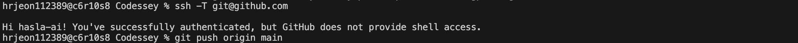 

끝
